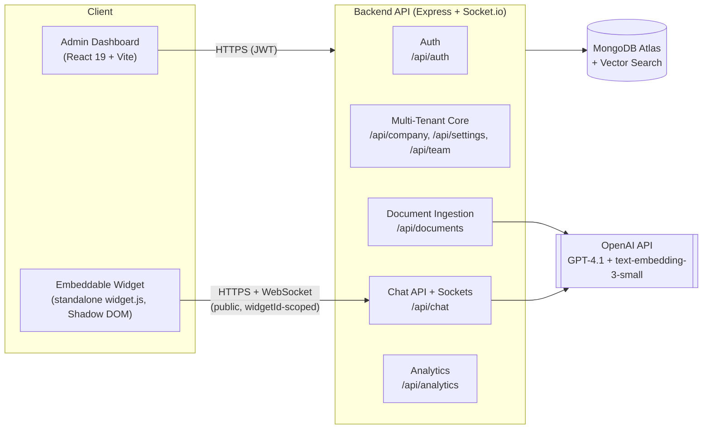

# Architecture

## System overview



## Monorepo layout

Three npm workspaces, each independently deployable:

```
backend/    Node.js/Express API — auth, multi-tenancy, RAG, chat, analytics
frontend/   React 19 admin dashboard (Vite) — also serves widget.js as a static asset
widget/     Embeddable chat widget — builds to frontend/public/widget.js (see below)
```

### backend/src

| Folder | Responsibility |
|---|---|
| `config/` | env validation, MongoDB connection, OpenAI client, Socket.io setup |
| `models/` | 9 Mongoose schemas: User, Company, Subscription, Document, Chunk, Conversation, Message, Analytics, Feedback |
| `repositories/` | Data-access layer — one file per model, no business logic |
| `services/` | Business logic (auth, company, user, document ingestion, RAG, chat, analytics, embeddings, email) |
| `controllers/` | Thin HTTP adapters — parse `req`, call a service, shape the response |
| `routes/` | Express routers, one per resource, wiring middleware + validators + controllers |
| `middleware/` | JWT auth, tenant resolution, RBAC, rate limiting, uploads, centralized error handling |
| `validators/` | `express-validator` chains per route group |
| `utils/` | Cross-cutting helpers: logging, sanitization, chunking, token helpers, API response envelope |

### frontend/src

Standard React app: `pages/` (auth + dashboard), `components/` (feature + shared `ui/`), `hooks/`, `contexts/` (auth), `lib/` (axios client, query client), `layouts/`.

### widget/src

A second, independent React app (its own Vite build, its own `App.jsx`), **not** a page inside `frontend/`:

- `index.js` — entry point. Reads `data-widget-id`/`data-theme` off its own `<script>` tag, creates a Shadow DOM host, and mounts React inside it.
- `hooks/useWidgetConfig.js`, `hooks/useSocketChat.js` — data/socket layer.
- `lib/` — a dependency-free `fetch` client (`api.js`), a `socket.io-client` factory (`socket.js`), and `localStorage` session persistence (`storage.js`).
- `components/` — launcher button, chat window, message list/bubble, sources, feedback, suggested questions, email-transcript modal.
- `types.js` — JSDoc `@typedef`s for the shapes shared across hooks/components (kept as plain JS, not `.ts`, for consistency with the rest of the monorepo).

## Multi-tenancy model

Every `Company` document carries two distinct identifiers:

- **`apiKey`** (`ak_...`, `select: false`) — sensitive, server-to-server only, never exposed to a browser.
- **`widgetId`** (`wid_...`, public) — embedded directly in the customer's HTML via the `<script data-widget-id="...">` tag. This is what the widget and its public endpoints use to resolve a company.

Authenticated dashboard routes resolve tenancy from the JWT (`authenticate` → `requireTenant`, which loads `req.company`/`req.companyId` from `req.user.companyId`). Public widget routes resolve tenancy from `widgetId` instead (`resolveWidgetTenant`, reading `req.body.widgetId` or `req.query.widgetId`), with **no JWT at all** — protection there is per-IP/per-socket rate limiting plus the subscription's monthly chat-limit check, not an auth token.

The widget's own "session" (an anonymous end-customer's identity) is a `sessionId` string on the `Conversation` document — not a cookie or JWT. The widget persists it in `localStorage` (keyed per `widgetId`) and replays it on every request; the server re-validates that a supplied `sessionId` actually belongs to the resolved company before reusing it (`chat.service.js`'s `_getOrCreateConversation`), which prevents one company's widget from reading another's conversation by guessing a `sessionId`.

## RAG ingestion pipeline

```
Upload (file) or URL
  → extractText()        (pdf-parse / mammoth / cheerio)
  → chunkText()           fixed-size chunks with overlap
  → embeddingService      batched calls to text-embedding-3-small, with retry
  → Chunk documents        stored with their vector + companyId + documentId
  → Document.status = 'ready'
```

Ingestion runs in the background via `setImmediate` after the HTTP response returns `status: pending` — for a multi-server deployment this is the seam where a real job queue (BullMQ) would replace `setImmediate`.

## Chat / RAG query pipeline

Two parallel transports hit the same `chat.service.js`, which is transport-agnostic (it knows nothing about HTTP or sockets):

- **REST** — `POST /api/chat` → `chatService.sendMessage()` → blocks until the full answer is ready, returns it in one response. Fallback for clients that can't use WebSockets.
- **Socket.io** — `chat:message` → `chatService.sendMessageStream()` → `ragService.queryStream()` streams tokens back as `chat:chunk` events, then a final `chat:done` with the full answer, sources, and metadata.

Both paths: enforce the subscription's chat limit → get-or-create the `Conversation` (by `sessionId`) → fetch recent history → save the user message → run RAG (vector search over `Chunk` documents scoped to `companyId`, build an XML-tagged context + anti-prompt-injection system prompt, call GPT-4.1) → save the assistant message → track analytics (non-blocking).

## Widget embedding model

The widget is compiled to a single IIFE bundle (`widget/vite.config.js`, `build.lib` + `format: 'iife'`) with `outDir: '../frontend/public'` — it ships as a static asset alongside the dashboard, not as its own hosted service. `index.js` attaches a **Shadow DOM** to an injected `<div>` so the widget's Tailwind-generated styles never leak into (or get overridden by) the host page's CSS, and vice versa. Per-company branding (colors, bot name, greeting, logo/avatar, position, suggested questions) is fetched once at mount from the public `GET /api/company/widget-config` endpoint and applied as CSS custom properties, since Tailwind utility classes are static at build time but each embedding company's theme is only known at runtime.
